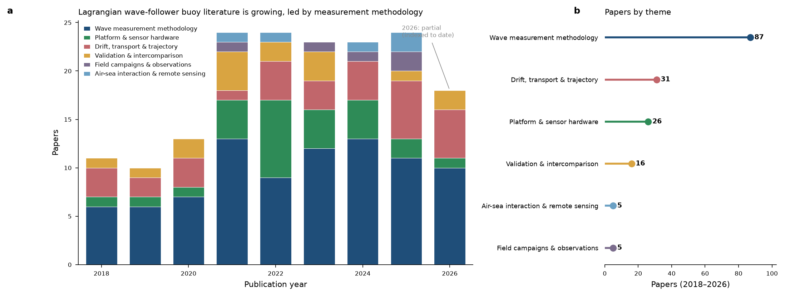
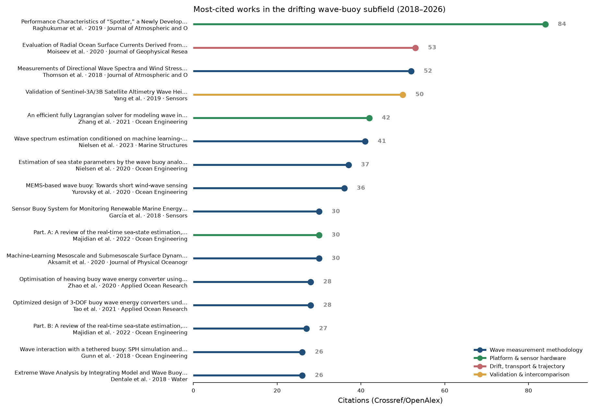
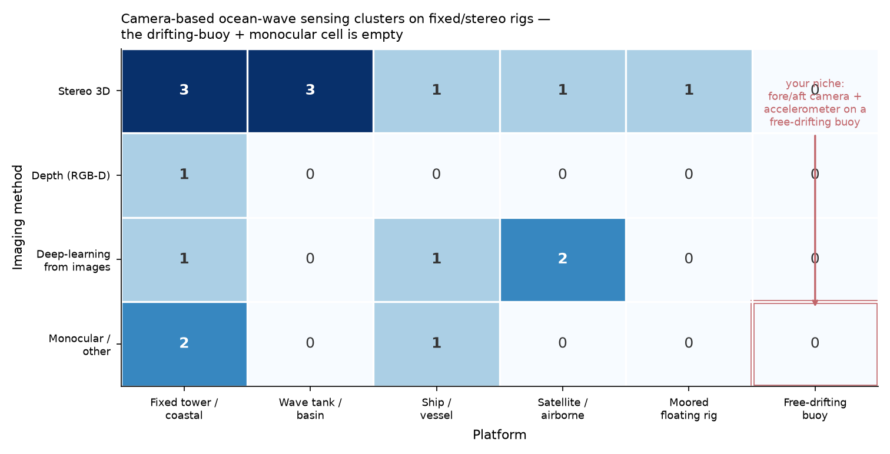

# Lagrangian / free-drifting wave-follower buoys — a field map

*A survey of the published work on free-drifting, wave-following buoy platforms (2018–2026): where the research clusters, who's most cited, and where the holes are. Compiled by [Kevin Griffin](https://orcid.org/0009-0005-0439-6684), 1 July 2026, as background for the [Lagrangian Wave Interrogator](https://git.sr.ht/~kevin_griffin/Lagrangian-Wave-Interrogator) project.*

## What this is (and who it's for)

This is a **field map**, not original research and not a peer-reviewed review article. It surveys 170 core papers on instruments that ride the water surface in a Lagrangian frame — the open/low-cost drift-buoy lineage (OpenMetBuoy, SWIFT/microSWIFT, Sofar Spotter, and kin) plus the GNSS/IMU wave-sensing and surface-drifter work around it — and organizes them so a newcomer can get oriented without repeating the whole search.

It's aimed at anyone entering the low-cost / open-hardware ocean-instrumentation space: makers, students, citizen scientists, and researchers scoping a new drifter project who want an overview of the field and, especially, the unfilled gaps worth aiming at.

## The shape of the field

Output roughly doubled over the window (~10–13 papers/yr in 2018–2020 to ~23–24/yr in 2021–2025), across six themes. Wave-measurement methodology dominates; drift/transport and platform/sensor hardware follow.

The full six-theme breakdown, the reference-platform table (Spotter / SWIFT / OpenMetBuoy / open designs), and the frontier notes are in **[`lagrangian_wave_buoy_literature_map.md`](lagrangian_wave_buoy_literature_map.md)**. The complete 170-record list with DOIs is in **[`lagrangian_wave_buoy_literature.csv`](lagrangian_wave_buoy_literature.csv)** (`year, theme, theme_name, citations, title, authors, venue, doi, url`).

## The central gap — a camera onboard a drifting buoy

A focused sub-survey of **camera-based** ocean-wave sensing (17 on-topic papers) shows the work clusters tightly on a few platform/method combinations — and one cell is empty.

- **Method:** 9 of the 17 use stereo multi-camera 3D reconstruction (WASS-style) — rigid baselines, heavy calibration, not drifter-friendly.
- **Platform:** the cameras sit on fixed coastal towers, wave tanks, ships, or satellites — observer-frame. Representative anchors: the Bergamasco/Benetazzo sea-surface stereo dataset (2020, the reference open stereo set); floating-but-moored stereo, [Jebari et al. 2025](https://doi.org/10.1016/j.oceaneng.2025.120958); a depth-camera on a rig, [Kim et al. 2023](https://doi.org/10.3390/jmse11030657); deep-learning sea-state from ship/shore imagery, [Umair et al. 2022](https://doi.org/10.3390/sym14071487); single-image spectrum from a satellite framing, [Titov et al. 2024](https://doi.org/10.1134/s0010952524601270); and an edge device tracking a buoy *from outside*, [Aravind et al. 2024](https://doi.org/10.1364/optcon.534428). The IMU-only free-drifting lineage is represented by the wavedrifter, [Feddersen et al. 2023](https://doi.org/10.1080/21664250.2023.2238949).

No paper in the set puts a camera **onboard a small free-drifting buoy** and fuses it with the buoy's own accelerometer: the free-drifting-buoy column, and the monocular cell within it, are empty.

Two other, softer gaps the broader map surfaces: directional-spreading validation for low-cost buoys is thin, and Eulerian-vs-Lagrangian sampling bias on wave spectra is discussed but not systematically quantified for the newer cheap platforms.

## How it was built

- **Discovery:** a Crossref bibliographic search across 18 phrase queries, journal-articles only, from 2018; abstracts back-filled from OpenAlex. 484 candidates → 219 on-topic after relevance filtering → 170 core (a 23-paper wave-energy-converter cluster was set aside as peripheral).
- **Relevance:** rule-based keyword scoring (wave-term × platform-term co-occurrence), then a per-paper LLM classification into the six themes.
- **Citation counts:** the max of Crossref and OpenAlex as of the harvest date; they undercount very recent (2025–2026) work, and 2026 is partial.

## Limitations

This is a builder's map, not an authoritative review. It was assembled by automated harvest plus my own reading and an LLM classifier — good for getting oriented fast, no substitute for a domain expert's systematic review. Treat the classifications as a useful first pass, the citation counts as approximate, and the gap claim as "empty in this corpus as harvested," not a proof that no such paper exists anywhere. If you're building on it, spot-check the cells that matter to you against the CSV.

## Files

| File | What |
|---|---|
| `README.md` | This overview |
| `lagrangian_wave_buoy_literature_map.md` | The full six-theme map, platform table, and frontier notes |
| `lagrangian_wave_buoy_literature.csv` | All 170 records with DOIs |
| `fig1_themes_over_time.png` | Annual output by theme |
| `fig2_top_cited.png` | Most-cited works by theme |
| `fig3_camera_gap_map.png` | Camera-based wave sensing: the empty cell |
| `LICENSE` | CC-BY-4.0 full text |

## Acknowledgements

Thanks to **James Cowan** of the British Columbia Institute of
Technology, liaison to [COMREN](https://oceanmapping.ca) (the Canadian
Ocean Mapping Research and Education Network), which funded travel to
the [Canadian Hydrographic Conference 2026](https://chc2026.org/en);
to **[Spicer Bak](https://orcid.org/0000-0001-6586-5409)**, who first
got me interested in waves at the surf line; and to **Avery Munoz** of
the University of New Hampshire, whose marine object-classification
work helped frame what a participant-frame platform should contribute.
Any errors in this map are mine alone.

## Citation & license

Released under **CC-BY-4.0** ([`LICENSE`](LICENSE)), matching the LWI project's documentation licensing. If you build on it:

> Griffin, Kevin (2026). *Lagrangian / free-drifting wave-follower buoys — a field map (2018–2026).* Part of the [Lagrangian Wave Interrogator](https://git.sr.ht/~kevin_griffin/Lagrangian-Wave-Interrogator) project. https://github.com/KevinGriffin-new/lagrangian-wave-buoy-field-map · ORCID: 0009-0005-0439-6684

If you need a citable snapshot, open an issue and I'll mint a Zenodo deposit with a resolvable DOI from this repository.
